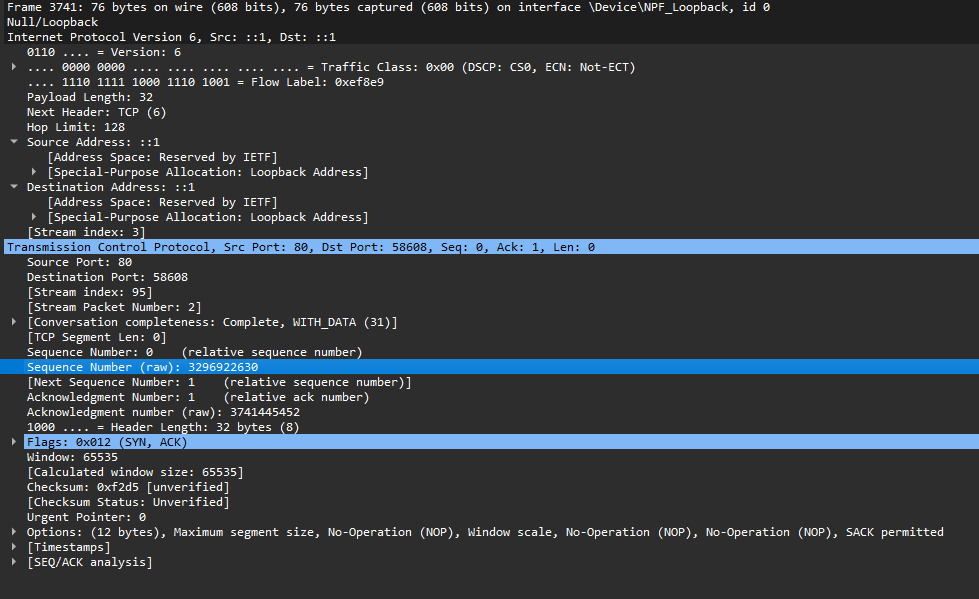

<h1 align="center"> WE Innovate Academy - Technical Assessment</h1>

<h2 align="center">Setting Up an Apache Server and Analyzing HTTP Traffic</h2>

### Tasks Solution:
1. Setting Up an Apache Web Server:
>by using docker, I setup needed environment to run apache web server that serve customized static web page as shown 👇

>>* create a simple project that contain needed files as shown 

>>*  create index.html to customize server response as required

>>* create docker file to build apache image with index.html file 

>>* build image from Dockerfile
>>>**Command:** docker build -t "image-name":"tag" . 
>>>>**hint:** you can use image from docker hub
>>>>>**Command:** docker pull moustafaeldesouky/customized-apache:2.4

>>* display docker images to confirm that image built successfully 
>>>**Command:** docker images

>>* run container from the image currently built 
>>>**Command:** docker run -d -it --name "container-name" -p "host-port":"container-port" "image-name"
>>>>**note:**-v added in the command below 👇 for development not for real use 

>>* show your container in docker desktop as below 👇 or use command to confirm that container is running
>>>**Command:** docker ps 

>>* go to browser and type http://localhost:80 you will see the web page as below 👇

___
2. Retrieving Customized Content Using curl:
>open terminal and type the following command
>>**Command:** curl http://localhost:80
>>>**hint:** you will get the index html page  

>>>> you can see my name and other content of the page
___
3. Sniffing HTTP Traffic Using WireShark:
> by capturing the tcp/ip traffic for the curl http get request to the server

>>**hint:** filtering WireShark on tcp.port==80 localhost traffic to get the specific packets of the apache server connection

> as shown above 👆 there are 11 packets that represent the simple connection between clint and server 

>>* first 3 packets represent 3 handshake between server and clint for synchronization and starting the connection

>>> clint syn -- TCP protocol 👇

>>> server syn & ack -- TCP protocol 👇

>>> clint ack -- TCP protocol 👇

>>* second 4 packets represent request - ack & response - ack 

>>> get request from curl command to the server 👇

>>> server ack -- TCP protocol 👇

>>> get response from server to curl 👇
>>>> here you can see html content that transmitted from server to clint

>>> clint ack -- TCP protocol 👇

>>* third 4 packets represent 4 handshake ending connection

>>> clint FIN & ack -- to end the connection  -- TCP protocol 👇

>>> server ack -- TCP protocol 👇

>>> server FIN & ack -- to end the connection  -- TCP protocol 👇

>>> clint ack -- TCP protocol 👇

 

